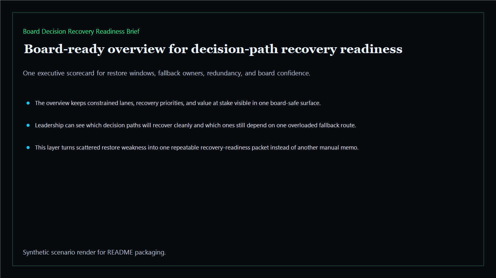
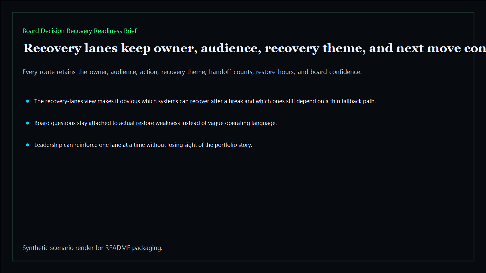
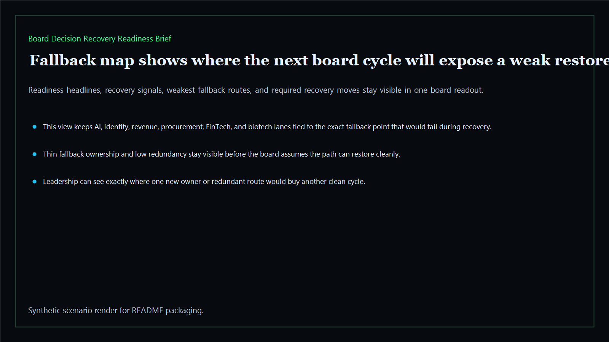
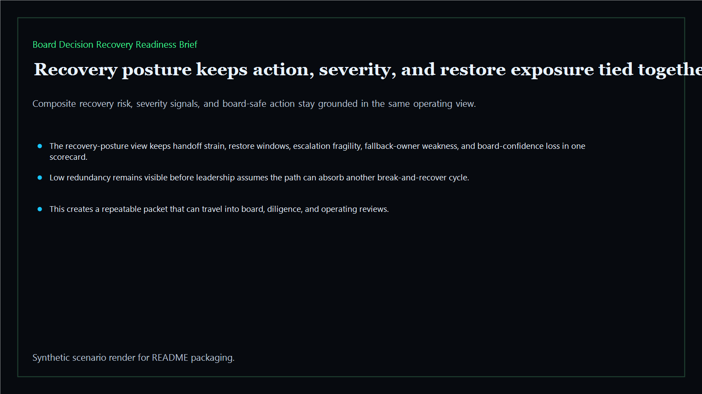

# Board Decision Recovery Readiness Brief

Board-ready recovery-readiness surface for showing whether executive decision paths can recover cleanly after failure, where fallback capacity is too thin, and what boards should reinforce before the next cycle starts.

- Live: `http://recovery.kineticgain.com/`
- Repo: `mizcausevic-dev/board-decision-recovery-readiness-brief`

## Why this matters

Leaders need one board-readable recovery layer that shows whether a broken path can be restored quickly, where fallback ownership is too thin, and which reinforcement move belongs in the packet before another cycle starts.

## What it includes

- TypeScript executive-intelligence surface for board-facing recovery readiness with modeled executive lanes, fallback capacity, and board-safe recovery posture
- synthetic executive lanes across AI, identity, revenue, FinTech, biotech, procurement, and public-sector readiness
- reusable outputs for recovery lanes, fallback maps, recovery posture, and board-ready operating memos
- prerendered static site, JSON payloads, screenshots, and docs

## Product depth

This is a recovery-readiness brief, not another incident recap. It helps executives decide whether critical decision paths can recover cleanly after failure, which fallback owners are overloaded, where redundant capacity is missing, and what should be reinforced before the next board or investor cycle.

- **Buyer value:** turns recovery risk into a board reinforcement sequence with one owner, restore window, fallback gap, and next move per lane.
- **Technical proof:** uses typed fixtures, deterministic scoring, JSON APIs, CLI output, static HTML, screenshots, and tests from the same packet.
- **GTM story:** useful for post-incident prep, diligence, transformation reviews, regulated operating reviews, and investor-facing recovery posture conversations.

## What these repos have in common

The executive-intelligence repos translate fragmented operating risk into buyer-readable decision surfaces. Each one keeps a narrow product promise, a visible scoring model, reproducible evidence, and a public route that ties back to the broader Kinetic Gain portfolio instead of standing alone as generic demo ware.

- **Board-ready language:** business owners get the decision, exposure, next move, and evidence trail without needing to inspect raw systems.
- **Operator-readable proof:** technical teams can inspect routes, fixtures, APIs, tests, and rendered assets to see how the story is produced.
- **Portfolio signal:** every surface strengthens the public map at `https://portfolio.kineticgain.com/` and the suite narrative at `https://suite.kineticgain.com/`.

## Operating workflow

1. Load the modeled recovery-readiness packet from `fixtures/`.
2. Score each lane for restore window, escalation gaps, fallback ownership, redundancy, and board confidence.
3. Render the overview, recovery lanes, fallback map, posture table, verification page, JSON payloads, and screenshots from the same source.
4. Publish the static site with deploy-time marker checks for product depth, portfolio links, and repo identity.

## Routes

- `/`
- `/recovery-lanes`
- `/fallback-map`
- `/recovery-posture`
- `/verification`
- `/docs`

## Local run

```bash
cd board-decision-recovery-readiness-brief
npm install
npm run verify
npm run prerender
npm run render:assets
```

## CLI

```bash
npx board-decision-recovery-readiness-brief fixtures/board-decision-recovery-readiness-brief.json --format summary
npx board-decision-recovery-readiness-brief fixtures/board-decision-recovery-readiness-brief-clean.json --format json
```

## Docs

- [Architecture](docs/architecture.md)
- [Origin](docs/ORIGIN.md)
- [Kinetic Gain Embedded](docs/KINETIC_GAIN_EMBEDDED.md)

## Screenshots





